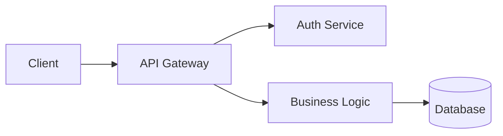

# 04 Architecture

## Purpose

The Architecture folder holds detailed architecture documentation, Architecture Decision Records (ADRs), system diagrams, and design documents. It is the authoritative source for understanding how the system is structured and why specific architectural choices were made.

## Contents

| Item | Type | Description |
|------|------|-------------|
| `ADR-NNN-<Title>.md` | ADR | Architecture Decision Records — one per significant decision |
| `SystemDiagram.md` | Diagram | High-level system component diagram |
| `DataFlow.md` | Diagram | How data moves through the system |
| `DeploymentTopology.md` | Diagram | Infrastructure and deployment layout |
| `SequenceDiagrams/` | Folder | Per-feature sequence diagrams |
| `ADR-Index.md` | Index | Chronological list of all ADRs with status |
| `README.md` | Guide | This file |

## Workflow

1. **New Decision**: When a significant architectural decision is made, create an ADR using the template from `13 Templates/`.
2. **ADR Numbering**: ADRs are numbered sequentially starting at `ADR-001`. Numbers are never reused.
3. **ADR Status**: Each ADR has a status: `Proposed` → `Accepted` | `Rejected` | `Superseded` by `ADR-NNN`.
4. **Diagram Updates**: When architecture changes, update relevant diagrams and note the change in the linked ADR.
5. **Review**: Architecture docs are reviewed during sprint planning for upcoming work that may require new ADRs.
6. **Cross-Linking**: ADRs link to related decisions in `08 Decisions/` and to implementation in `06 Development/`.

## Conventions

- ADRs follow the Michael Nygard template: Context, Decision, Status, Consequences.
- ADR filenames: `ADR-NNN-Short-Title.md` (kebab-case).
- Diagrams use Mermaid syntax for version-controllability.
- Each ADR includes a `Date` and `Deciders` field.
- Superseded ADRs are never deleted — their status is updated and a link to the superseding ADR is added.
- Architecture docs reference `01 Project/Architecture.md` for the high-level overview.

## Examples

```markdown
## ADR file structure

# ADR-001: Initial Architecture

## Status
Accepted

## Date
2026-06-01

## Deciders
@lead-architect, @tech-lead

## Context
[Why this decision is needed...]

## Decision
[What was decided...]

## Consequences
[Positive, negative, and neutral effects...]
```


