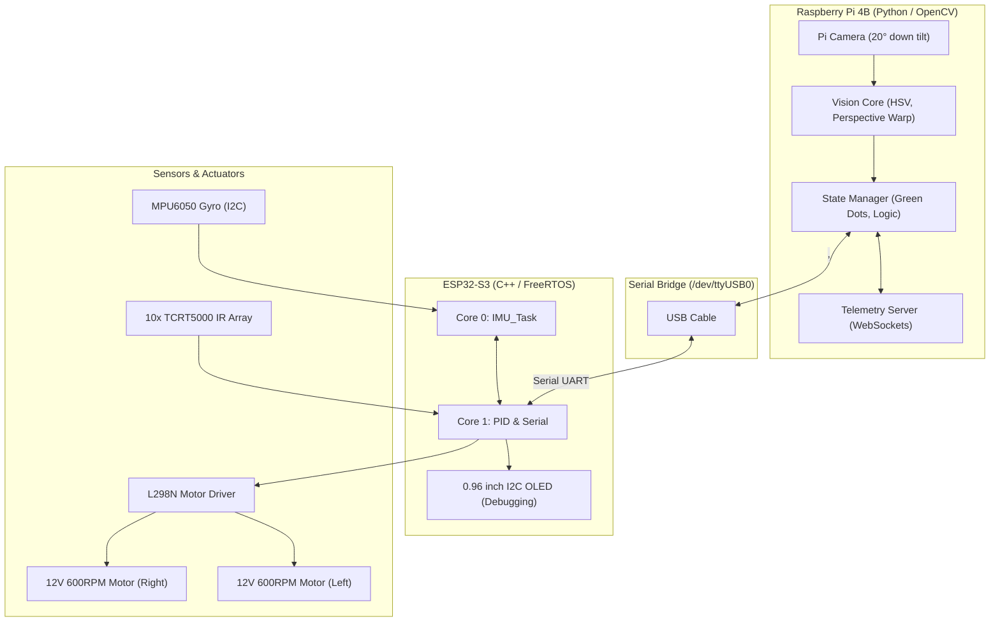

# DPSI-LFR V2 Architecture Diagram

This diagram outlines the dual-brain architecture and data flow for the V2 robot.

```mermaid
graph TD
    %% Hardware Components
    subgraph Pi["Raspberry Pi 4B (Python / OpenCV)"]
        Cam["Pi Camera (20° down tilt)"]
        VC["Vision Core (HSV, Perspective Warp)"]
        SM["State Manager (Green Dots, Logic)"]
        TM["Telemetry Server (WebSockets)"]
        
        Cam --> VC
        VC --> SM
        SM <--> TM
    end

    subgraph Serial["Serial Bridge (/dev/ttyUSB0)"]
        USB["USB Cable"]
    end

    subgraph ESP["ESP32-S3 (C++ / FreeRTOS)"]
        Core0["Core 0: IMU_Task"]
        Core1["Core 1: PID & Serial"]
        OLED["0.96 inch I2C OLED (Debugging)"]
        
        Core0 <--> Core1
        Core1 --> OLED
    end

    subgraph Peripherals["Sensors & Actuators"]
        IMU["MPU6050 Gyro (I2C)"]
        IR["10x TCRT5000 IR Array"]
        L298["L298N Motor Driver"]
        M_L["12V 600RPM Motor (Left)"]
        M_R["12V 600RPM Motor (Right)"]
        
        IMU --> Core0
        IR --> Core1
        Core1 --> L298
        L298 --> M_L
        L298 --> M_R
    end

    %% Connections
    SM <-->|"<L_SPEED>,<R_SPEED>\n<TURN_90>"| USB
    USB <-->|Serial UART| Core1
```
