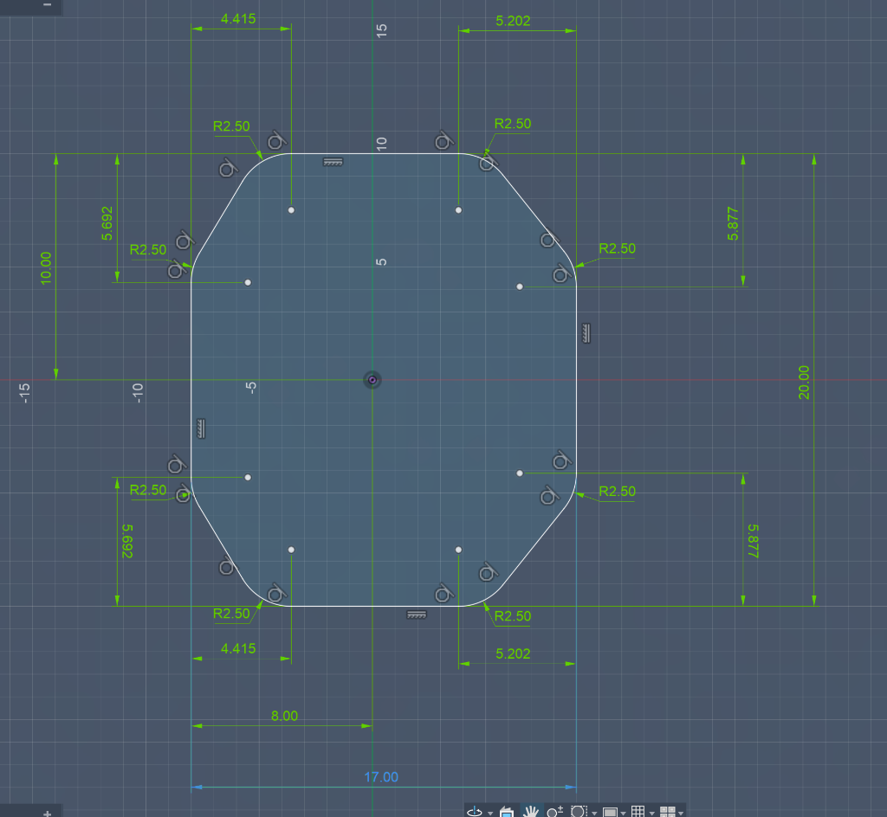

# DPSI LFR V3 - Rescue Robotics Platform

Welcome to the **DPSI LFR V3** repository. This branch (`dpsi_lfr_v3`) contains the architectural plans, hardware designs, and development milestones for our next-generation autonomous mobile manipulator.

## Project Overview

The DPSI LFR V3 is designed to bridge high-speed line following with autonomous room navigation and robotic manipulation. It is built to compete in the Rescue Robotics Arena, adhering strictly to the 25x25 cm footprint limits.

### Core Capabilities
- **High-Speed Line Following**: Custom adaptive PID/RK4 logic over 3-ROI extraction.
- **Autonomous Navigation**: Untethered room mapping using SLAM Toolbox and Nav2 via an Intel RealSense depth camera.
- **Manipulation**: Object sorting (black/white pucks to red/green bins) using a MeArm v1 robotic arm controlled by MoveIt 2.

## Chassis Design

The robot uses a custom 3-layer, 17x20 cm laser-cut chassis to ensure maximum rigidity and a low center of gravity.
- **Layer 1 (Bottom)**: Motors, Casters, Downward Camera, and Battery (Rear).
- **Layer 2 (Middle)**: MeArm v1 base (Front).
- **Layer 3 (Top)**: Raspberry Pi 5, RRC Lite (STM32), and RealSense Camera.

## Documentation

Please explore the following folders and files for detailed plans:
- **`hardware/`**: Contains [`chassis_design.md`](hardware/chassis_design.md) and [`components.md`](hardware/components.md).
- **`architecture/`**: Contains [`software_architecture.md`](architecture/software_architecture.md) and [`system_overview.md`](architecture/system_overview.md).
- **[`milestones.md`](milestones.md)**: Tracks our 3 major development phases.
- **[`progress.md`](progress.md)**: Current project checklist.

## Tech Stack
- **OS**: Ubuntu
- **Framework**: ROS 2 Jazzy, micro-ROS
- **Compute**: Raspberry Pi 5, STM32 (RRC Lite Controller)
