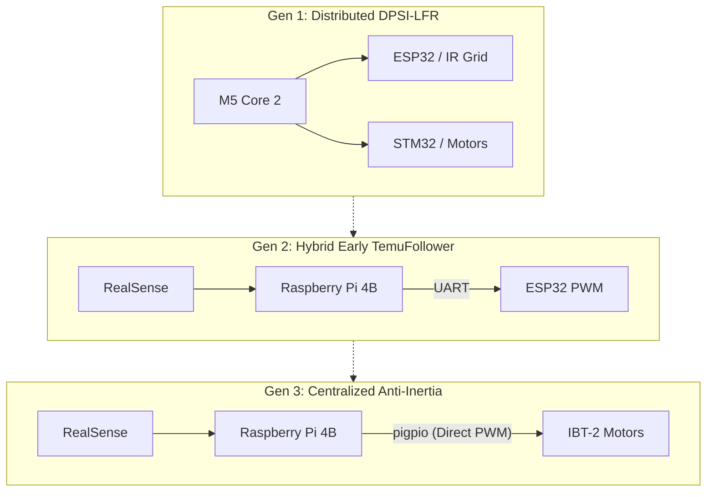
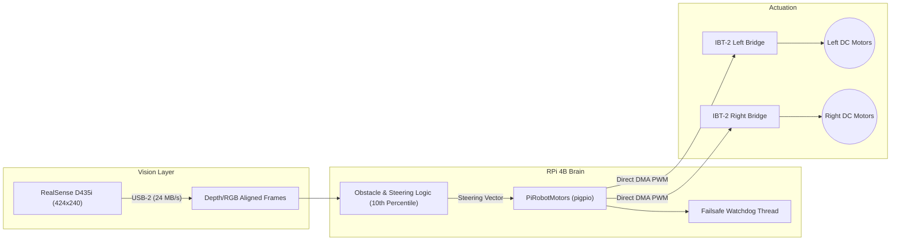
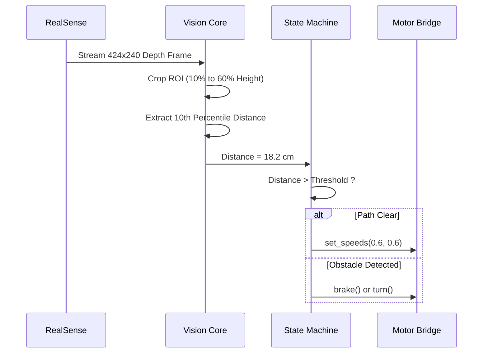
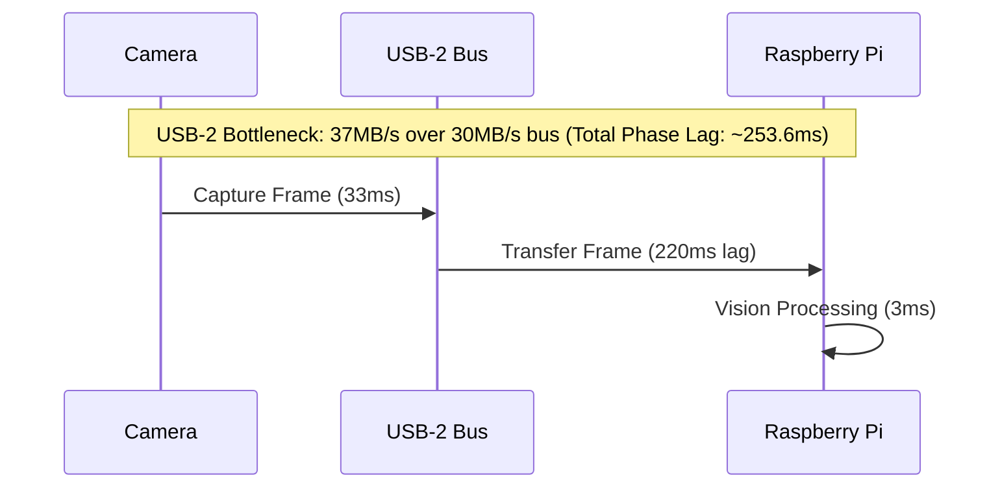
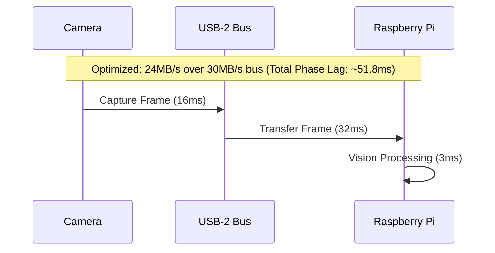

# PROJECT REPORT

  
  
  

**Project Name –:** Temuv2 Autonomous Rescue Platform (formerly DPSI-LFR)

**Team Name –:** Anti-Inertia

**Source Repositories:** 
- [DPSI-LFR (Legacy Base)](https://github.com/Ojas-sta/DPSI-LFR)
- [TemuFollower (Active Development)](https://github.com/pop-bop/TemuFollower)

---

### 1. Team Introduction

| Sr.no | Member Name | Role in Project |
| :---: | :--- | :--- |
| 1 | Ojas S | Head of architecture and software fusion |
| 2 | Vatsal | Strategy workflows, hardware testing, and documentation |
| 3 | Ojas P | Lead for Temuv2.5 software architecture, high-speed line following, and telemetry GUI |

---

### 2. Project Overview 
*(Briefly describe what your project is about.)*

Temuv2 is a highly advanced autonomous rescue line-follower and obstacle-avoidance robot. Its architecture has evolved dramatically over multiple generations, transitioning from a distributed multi-microcontroller logic base (M5 Core 2 + ESP32 + STM32) to a centralized, high-bandwidth computing platform relying exclusively on a Raspberry Pi 4B and an Intel RealSense D435i Depth Camera. The system processes a 3D depth cloud for 15 cm obstacle detection, visual line tracking, and generates zero-latency DMA-timed software PWM directly to heavy-duty motor controllers to achieve highly precise differential drive maneuvers.

**Architecture Evolution:**

---

### 3. Components Used

| Component Name | Quantity | Detail |
| :--- | :---: | :--- |
| **Raspberry Pi 4B** | 1 | The central brain; handles RealSense 3D vision processing, AI steering logic, and direct PWM motor generation. |
| **Intel RealSense D435i** | 1 | Provides stereo depth cloud and RGB video streams for 15 cm obstacle detection and visual line tracking. |
| **IBT-2 (BTS7960) Drivers** | 2 | High-current H-bridge motor controllers driving the left and right sides of the chassis up to 43A. |
| **DC Gear Motors** | 4 | Differential drive system wired in parallel (Front-Left/Rear-Left and Front-Right/Rear-Right). |
| **LM2596 / XL4016** | 1 | Step-down buck converter providing a stable 5V logic rail from the 3S LiPo battery. |
| *(Deprecated)* ESP32 DevKit V1 | 1 | Originally used as a UART-to-PWM bridge for the motors before being ditched due to silent transport failures. |
| *(Deprecated)* M5 Core 2 | 1 | Originally the AI host in the older DPSI-LFR MC4.0 build. |

---

### 4. Workflow and Design Approach
*(Explain your design strategy and workflow of the project.)*

The design philosophy shifted drastically from **distributed microcontrollers** to **centralized high-bandwidth computing**:

- **Old Design (DPSI-LFR):** We attempted to offload timing-critical tasks to dedicated MCUs. An ESP32 bit-banged a 20-sensor IR grid, passing data via UART to an M5 Core 2 which ran CNNs and PCA logic. The M5 then instructed an STM32/ESP8266 via I2C to execute motor PWM. This led to extreme I/O complexity and latent points of failure.
- **New Design (TemuFollower / Anti-Inertia):** We moved to visual depth tracking via the Intel RealSense camera. Initially, the Raspberry Pi computed steering and sent UART commands to an ESP32, which acted as a PWM generator. However, in the final iterations, the ESP32 was entirely bypassed. The RPi 4B now utilizes the `pigpio` daemon to generate DMA-timed software PWM directly on its GPIO pins, removing the UART hop and ensuring zero-latency, fail-safe motor control. 

**Vision Strategy:** The robot scans the middle 10% to 60% of the camera frame (ignoring the floor). Instead of a noisy median filter, we run a 10th percentile array sampling (`np.percentile(valid_depths, 10)`) to lock onto the absolute closest physical barrier.

**Final Anti-Inertia Architecture:**

---

### 5. Implementation Process
*(Describe, step by step, how you actually built and assembled the project.)*

1. **Legacy AI Implementation:** Developed a Hierarchical Mixture of Experts (H-MoE) and a Temporal Transformer memory system in Python to navigate dashed lines and intersections using historical IR sensor states.
2. **Camera Integration & Profiling:** Migrated to `pyrealsense2` on the RPi. Implemented a 10-frame auto-exposure warmup cycle and a "Visual Compass" (extracting physical heading vectors from raw camera pixels).
3. **Obstacle Detection Logic:** Configured a strict 15.0 cm wall threshold. Integrated zero-depth ratio monitoring to immediately flag a "WALL STOP" and block forward motion if stereo breakdown occurs.
4. **Ditching the ESP32 (The Motor Backend Overhaul):** Wrote `pi_motors.py` to completely replace the ESP32 UART hop. Configured `pigpio` to generate independent PWM signals for the Left/Right LPWM and RPWM pins of the IBT-2 drivers, along with a dedicated failsafe watchdog thread that immediately kills motor power if the control loop hangs.
5. **Timeline Generation:** We meticulously tracked all updates across 157 commits spanning the `DPSI-LFR` and `TemuFollower` repositories to record our evolutionary steps (detailed in section 10).

**Vision Processing State Machine:**

---

### 6. Challenges Faced
*(Document any problems, errors, or obstacles you encountered during the project).*

- **The ESP32 Motor Bottleneck:** The ESP32 UART backend proved highly unreliable. If the serial port disconnected or failed, the transport went completely silent. The control loop on the Pi would continue logging "healthy" motor commands while the physical robot crashed into walls with dead or unresponsive motors.
- **PID Oscillation & Loop Phase Lag:** The robot suffered from severe "hunting" (oscillation) during steering. Initially blamed on bad PID gains, the team discovered a massive **253.6ms phase lag** in the steering path.
- **USB-2 Bandwidth Limitations:** The RealSense D435i was connected via a USB-2 link (sustaining max ~30 MB/s). The vision pipeline requested 640x480 color+depth at 30fps, which required ~37 MB/s. Profiling proved the Python code was fast (~3ms/frame), but the USB bandwidth bottleneck caused the camera frame rate to collapse to ~22fps, directly causing the 253ms phase lag.

**Phase Lag & Bottleneck Visualization:**

---

### 7. Solutions and Troubleshooting
*(Explain how you identified and solved each challenge listed above.)*

- **Ditching the ESP32:** To fix the silent UART failures, the team bypassed the ESP32 entirely. We wired the IBT-2 motor controllers directly to the Raspberry Pi and used `pigpio` for DMA-timed PWM (`pi_motors.py`). We implemented an aggressive software watchdog that cuts power if commands cease for more than 0.3 seconds.
- **Fixing the USB-2 Phase Lag:** To resolve the PID hunting, we dropped the RealSense resolution to a native `424x240@60fps` format. This reduced the data rate to ~24 MB/s, fitting comfortably within the USB-2 bandwidth limit. This slashed the phase lag from 253.6ms down to **51.8ms**, allowing the robot to carry proportional gain ($K_p=0.10$) smoothly without oscillating.

**Phase Lag Resolution Visualization:**

---

### 9. Learning and Reflection
*(What new skills or concepts did you learn while working on this project.)*

- **Bandwidth vs. Compute:** We learned that bottlenecks aren't always in code execution. Profiling proved the Python vision code was lightning-fast (3ms), but hardware bus limits (USB-2 bandwidth) were silently destroying the control loop's frame rate.
- **Phase Lag in Control Systems:** We realized that "hunting" is rarely just a PID gain problem. Adding derivative smoothing and deadband steps actually worsened the steering because every addition introduced more phase lag. Removing the lag at the source (the camera framerate) instantly solved the oscillation.
- **Simplicity over Complexity:** The project started with a highly complex triple-processor architecture (M5 + ESP32 + STM32) and ended up running vastly superiorly on a single Raspberry Pi directly driving the motors.

---

### 10. Future Improvements & Historical Timeline

**Future Improvements:**
- **Marker Classification Refinement:** The green marker logic requires the verdict to repeat for `MARKER_CONFIRM_FRAMES` to prevent reflections from latching a turn. This needs physical track tuning.
- **Re-integrating AI Workspaces:** Porting the legacy Temporal Global Workspace (Transformer memory) from the older DPSI-LFR build to run atop the new 60fps RealSense data stream to anticipate dashed lines before they appear.

#### Complete Development Timeline

##### 2026-05-19
**Major Milestones:** Focused on: *Initial commit: Professional repository structure with CNN-based classifier and competition analysis docs* and *Add critical hardware safety review and scaling documentation*, alongside 1 other updates across DPSI-LFR.

View detailed 3 commits for 2026-05-19

| Repo | Branch | Hash | Commit Message | Details (What & Why) |
|---|---|---|---|---|
| DPSI-LFR | `main` | `1c08d8a` | Add critical hardware safety review and scaling documentation | *(No extended details provided in commit body)* |
| DPSI-LFR | `main` | `13ab901` | Add detailed wiring pinouts and design links to resources | *(No extended details provided in commit body)* |
| DPSI-LFR | `main` | `512bdc3` | Initial commit: Professional repository structure with CNN-based classifier and competition analysis docs | *(No extended details provided in commit body)* |

##### 2026-05-20
**Major Milestones:** Focused on: *Update README with new AI features and create timestamped FEATURE_LOG* and *Add session logs and in-depth encoder-less control documentation*, alongside 1 other updates across DPSI-LFR.

View detailed 3 commits for 2026-05-20

| Repo | Branch | Hash | Commit Message | Details (What & Why) |
|---|---|---|---|---|
| DPSI-LFR | `main` | `bdff7a4` | Update README with new AI features and create timestamped FEATURE_LOG | *(No extended details provided in commit body)* |
| DPSI-LFR | `main` | `178fdaa` | Add session logs and in-depth encoder-less control documentation | *(No extended details provided in commit body)* |
| DPSI-LFR | `main` | `f290666` | Update AI_Goal.py and add Movement.py from PythonProject | *(No extended details provided in commit body)* |

##### 2026-05-21
**Major Milestones:** Focused on: *Refactor M5 Core 2: Remove M5Core2.h, implement standalone Arduino firmware with minimal MPU6886 driver and high-speed telemetry* and *Add MC4.0 Advanced Architecture: Distributed C3 Sensor Pod, Core 2 WebSocket Control, and system documentation*, alongside 4 other updates across DPSI-LFR.

View detailed 6 commits for 2026-05-21

| Repo | Branch | Hash | Commit Message | Details (What & Why) |
|---|---|---|---|---|
| DPSI-LFR | `main` | `af30aa6` | Refactor M5 Core 2: Remove M5Core2.h, implement standalone Arduino firmware with minimal MPU6886 driver and high-speed telemetry | *(No extended details provided in commit body)* |
| DPSI-LFR | `main` | `c1cecd1` | Optimize MC4-Advanced: 460,800 baud UART, fused MPU/Encoder telemetry, and low-latency WebSocket UI | *(No extended details provided in commit body)* |
| DPSI-LFR | `main` | `6394433` | Update docs with MC4.0 Chassis integration and Distributed Architecture details | *(No extended details provided in commit body)* |
| DPSI-LFR | `main` | `607aab5` | Link FEATURE_LOG.md and add Latest Updates to README | *(No extended details provided in commit body)* |
| DPSI-LFR | `main` | `bbc61d4` | Add SIMU.py simulator and sync latest AI files including weights | *(No extended details provided in commit body)* |
| DPSI-LFR | `main` | `4f1485f` | Add MC4.0 Advanced Architecture: Distributed C3 Sensor Pod, Core 2 WebSocket Control, and system documentation | *(No extended details provided in commit body)* |

##### 2026-05-22
**Major Milestones:** Focused on: *Consolidate architecture: ESP32 C3 now handles direct I2C motor control and sensor processing. M5 Core 2 transitioned to physical host/power source.* and *Upgrade to ESP32-S 20-Sensor (4x5) Grid Architecture: Integrated 4x line follower boards and direct I2C motor control*, alongside 3 other updates across DPSI-LFR.

View detailed 5 commits for 2026-05-22

| Repo | Branch | Hash | Commit Message | Details (What & Why) |
|---|---|---|---|---|
| DPSI-LFR | `main` | `18142f9` | Update documentation: Documented full Python AI suite (H-MoE + Transformer) and Digital Twin Simulators | *(No extended details provided in commit body)* |
| DPSI-LFR | `main` | `6bc6bc5` | Migrate full Python AI suite: Added Hierarchical MoE, Transformer memory logic, and simulation tools | *(No extended details provided in commit body)* |
| DPSI-LFR | `main` | `29feba4` | Upgrade to ESP32-S 20-Sensor (4x5) Grid Architecture: Integrated 4x line follower boards and direct I2C motor control | *(No extended details provided in commit body)* |
| DPSI-LFR | `main` | `c2e999c` | Migrate to ESP32-S NodeMCU: Update I2C pins and sensor configuration | *(No extended details provided in commit body)* |
| DPSI-LFR | `main` | `2924aa7` | Consolidate architecture: ESP32 C3 now handles direct I2C motor control and sensor processing. M5 Core 2 transitioned to physical host/power source. | *(No extended details provided in commit body)* |

##### 2026-05-25
**Major Milestones:** Focused on: *Final Optimized Pinout: Grouped motor control on right, encoders on left, and safe sensor pins on bottom* and *Upgrade ESP32-S3 firmware and docs: Added high-performance PWM/Encoder control and detailed wiring map*, alongside 1 other updates across DPSI-LFR.

View detailed 3 commits for 2026-05-25

| Repo | Branch | Hash | Commit Message | Details (What & Why) |
|---|---|---|---|---|
| DPSI-LFR | `main` | `16b4913` | Final Optimized Pinout: Grouped motor control on right, encoders on left, and safe sensor pins on bottom | *(No extended details provided in commit body)* |
| DPSI-LFR | `main` | `513195d` | Add ESP32-S Integrated Pro Pilot: Direct L293D motor control with relocated 20-sensor grid pins | *(No extended details provided in commit body)* |
| DPSI-LFR | `main` | `9c52954` | Upgrade ESP32-S3 firmware and docs: Added high-performance PWM/Encoder control and detailed wiring map | *(No extended details provided in commit body)* |

##### 2026-05-26
**Major Milestones:** Focused on: *Final Update: Integrated Pro Pilot with Blueprint pinout and added single-encoder debug script* and *Migrate advanced 11-layer Memory Transformer and Cross-Attention AI logic from PythonProject*, alongside 4 other updates across DPSI-LFR.

View detailed 6 commits for 2026-05-26

| Repo | Branch | Hash | Commit Message | Details (What & Why) |
|---|---|---|---|---|
| DPSI-LFR | `main` | `667f415` | Sync remaining weights and project configuration | *(No extended details provided in commit body)* |
| DPSI-LFR | `main` | `c6ec659` | Commit large model weights using Git LFS | *(No extended details provided in commit body)* |
| DPSI-LFR | `main` | `209f4a8` | Fix: Remove 1GB weights file and add .gitignore to exclude large binaries | *(No extended details provided in commit body)* |
| DPSI-LFR | `main` | `5f12f4b` | Migrate advanced 11-layer Memory Transformer and Cross-Attention AI logic from PythonProject | *(No extended details provided in commit body)* |
| DPSI-LFR | `main` | `ffffbe8` | Update repository with latest AI logic, simulators, and configuration from PythonProject | *(No extended details provided in commit body)* |
| DPSI-LFR | `main` | `6a84da7` | Final Update: Integrated Pro Pilot with Blueprint pinout and added single-encoder debug script | *(No extended details provided in commit body)* |

##### 2026-06-29
**Major Milestones:** Focused on: *feat: integrate v2 codebase from claude, add gitignore, create obsidian hub, and cleanup root* and *docs: finalize comprehensive AI-KOS V2 architecture blueprints via teamwork preview*, alongside 8 other updates across DPSI-LFR.

View detailed 10 commits for 2026-06-29

| Repo | Branch | Hash | Commit Message | Details (What & Why) |
|---|---|---|---|---|
| DPSI-LFR | `main` | `4ed0326` | fix: update ledc API for esp32 core v2 compatibility | *(No extended details provided in commit body)* |
| DPSI-LFR | `main` | `8ba7804` | feat: implement esp32 diagnostics firmware | *(No extended details provided in commit body)* |
| DPSI-LFR | `main` | `e18cec3` | docs: generate diagnostic self test web server architecture and claude prompt | *(No extended details provided in commit body)* |
| DPSI-LFR | `main` | `c86d76e` | docs: generate extensive professional README detailing architecture and RTOS | *(No extended details provided in commit body)* |
| DPSI-LFR | `main` | `4970ef6` | feat: integrate v2 codebase from claude, add gitignore, create obsidian hub, and cleanup root | *(No extended details provided in commit body)* |
| DPSI-LFR | `main` | `2b39628` | docs: finalize comprehensive AI-KOS V2 architecture blueprints via teamwork preview | *(No extended details provided in commit body)* |
| DPSI-LFR | `main` | `ce61820` | docs: remove buttons and add architecture diagram | *(No extended details provided in commit body)* |
| DPSI-LFR | `main` | `eb1b0a3` | feat: add OLED and push buttons to hardware specs | *(No extended details provided in commit body)* |
| DPSI-LFR | `main` | `54ba7d5` | docs: finalize V2 hardware specs via grill-me session | *(No extended details provided in commit body)* |
| DPSI-LFR | `main` | `d5cdbcd` | feat: initiate V2 architecture from scratch, removing deprecated AI grid/CNN | *(No extended details provided in commit body)* |

##### 2026-06-30
**Major Milestones:** Focused on: *docs: update README with detailed TUI features and comments, set manual turn base speed to 1.0 for max speed turns* and *feat: reduce calibration to 20s, increase gyro scaling to 1.4x, and force black window background in TUI*, alongside 24 other updates across DPSI-LFR.

View detailed 26 commits for 2026-06-30

| Repo | Branch | Hash | Commit Message | Details (What & Why) |
|---|---|---|---|---|
| DPSI-LFR | `main` | `2450404` | docs: update README with detailed TUI features and comments, set manual turn base speed to 1.0 for max speed turns | *(No extended details provided in commit body)* |
| DPSI-LFR | `main` | `d9d5c10` | feat: add skip calibration option and toggles for Steer Assist and Heading Correction | *(No extended details provided in commit body)* |
| DPSI-LFR | `main` | `4849cf5` | feat: increase gyro integration scale factor to 3.0x | *(No extended details provided in commit body)* |
| DPSI-LFR | `main` | `065f92d` | feat: reduce calibration to 20s, increase gyro scaling to 1.4x, and force black window background in TUI | *(No extended details provided in commit body)* |
| DPSI-LFR | `main` | `2200100` | feat: add 60-second IMU calibration and curses progress screen on startup | *(No extended details provided in commit body)* |
| DPSI-LFR | `main` | `f6c29e5` | feat: move IMU integration to a separate thread at 50Hz and print calibration errors to telemetry log | *(No extended details provided in commit body)* |
| DPSI-LFR | `main` | `cafbbee` | feat: add drift trim bias controls and dynamic ASCII compass TUI widget from integrated MPU6050 yaw | *(No extended details provided in commit body)* |
| DPSI-LFR | `main` | `6d0afcf` | fix: swap physical motor outputs to fix A/D direction and support key-decay based curving (W+A / W+D) | *(No extended details provided in commit body)* |
| DPSI-LFR | `main` | `03c19ca` | fix: revert buzzer to active-high to prevent continuous buzzing | *(No extended details provided in commit body)* |
| DPSI-LFR | `main` | `fd1216f` | fix: removed send_mode C:0 on manual toggle which caused ESP to ignore UART | *(No extended details provided in commit body)* |
| DPSI-LFR | `main` | `44b1e22` | fix: continuously broadcast motor speeds to prevent ESP watchdog timeouts | *(No extended details provided in commit body)* |
| DPSI-LFR | `main` | `8de1da5` | fix: active-low LED and Buzzer handling, update TonalBuzzer to Buzzer | *(No extended details provided in commit body)* |
| DPSI-LFR | `main` | `9c1ae9f` | feat: complete TUI overhaul with ASCII art, colored speed monitors, and serial ping-pong | *(No extended details provided in commit body)* |
| DPSI-LFR | `main` | `ef731b6` | Fix PATH issues on RPi for lfr-cli installation | *(No extended details provided in commit body)* |
| DPSI-LFR | `main` | `3a34302` | Fix install.sh: replace libatlas-base-dev with libopenblas-dev for Debian Trixie support | *(No extended details provided in commit body)* |
| DPSI-LFR | `main` | `69a023e` | Update master_pinout.md with ESP8266 and Raspberry Pi configurations | *(No extended details provided in commit body)* |
| DPSI-LFR | `main` | `f998b97` | Update README.md with diagnostics and installation instructions | *(No extended details provided in commit body)* |
| DPSI-LFR | `main` | `4510658` | Implement self-updating CLI package setup and ESP UART updates | *(No extended details provided in commit body)* |
| DPSI-LFR | `main` | `e29dce0` | Create rbpi_package from TemuFollower with architecture updates | *(No extended details provided in commit body)* |
| DPSI-LFR | `main` | `4fc1b5f` | Flip left and right steering direction in joystick UI | *(No extended details provided in commit body)* |
| DPSI-LFR | `main` | `7eca521` | Reverse motor direction logic and add HTML5 joystick to dashboard | *(No extended details provided in commit body)* |
| DPSI-LFR | `main` | `553e546` | Fix memory corruption and adjust telemetry frequency | *(No extended details provided in commit body)* |
| DPSI-LFR | `main` | `221b34b` | Migrate diagnostics firmware from ESP32 to ESP8266 NodeMCU at 160MHz | *(No extended details provided in commit body)* |
| DPSI-LFR | `main` | `920a884` | Add zipped firmware project for easy transfer | *(No extended details provided in commit body)* |
| DPSI-LFR | `main` | `307d5ba` | Migrate ESP32 diagnostics firmware to DevKit V1 | - Target board changed to esp32doit-devkit-v1 - Left-side sequential motor pin remapping (32, 33, 25, 26, 27, 14) - Reserved safe ADC1 analog pins (34, 35) - Removed all IR array and MPU6050 logic from dashboard and C++ source - Updated master pinout diagram |
| DPSI-LFR | `main` | `859195b` | feat: implement Self_Test_Diagnostics, LED actions, and master pinout | *(No extended details provided in commit body)* |

##### 2026-07-01
**Major Milestones:** Focused on: *feat: invert reverse trim bias target for visual alignment and add independent customizable Turn Speed Cap via Shift+[]* and *Integrate node.py and cli.py for auto line following with non-blocking queues*, alongside 3 other updates across DPSI-LFR.

View detailed 5 commits for 2026-07-01

| Repo | Branch | Hash | Commit Message | Details (What & Why) |
|---|---|---|---|---|
| DPSI-LFR | `main` | `c4c0d6a` | Integrate node.py and cli.py for auto line following with non-blocking queues | *(No extended details provided in commit body)* |
| DPSI-LFR | `main` | `69fca42` | Integrate Picamera2 into VisionAgent for Bookworm support | *(No extended details provided in commit body)* |
| DPSI-LFR | `main` | `b85abc3` | Fix CLI turn speed display and reverse trim bias | *(No extended details provided in commit body)* |
| DPSI-LFR | `main` | `04d72b1` | Update repository changes | *(No extended details provided in commit body)* |
| DPSI-LFR | `DPSI_LFR_v2` | `32cb8ed` | feat: invert reverse trim bias target for visual alignment and add independent customizable Turn Speed Cap via Shift+[] | *(No extended details provided in commit body)* |

##### 2026-07-02
**Major Milestones:** Focused on: *feat: implement convolutional encoder and asynchronous tiered replay buffer for training pipeline* and *feat: implement WeOneWire protocol driver and add motor testing and web-based control interfaces*, alongside 4 other updates across TemuFollower, DPSI-LFR.

View detailed 6 commits for 2026-07-02

| Repo | Branch | Hash | Commit Message | Details (What & Why) |
|---|---|---|---|---|
| DPSI-LFR | `main` | `889eeb6` | Add README with installation and usage instructions | Added detailed instructions for installation, usage, and configuration of the DPSI-LFR Pi-Only Line Follower project, including commands for setup and operation. |
| DPSI-LFR | `main` | `fe1a8ed` | Add Pi-only line follower release setup | *(No extended details provided in commit body)* |
| DPSI-LFR | `main` | `f11bba8` | feat: implement convolutional encoder and asynchronous tiered replay buffer for training pipeline | *(No extended details provided in commit body)* |
| DPSI-LFR | `main` | `bf5d57d` | feat: implement WeOneWire protocol driver and add motor testing and web-based control interfaces | *(No extended details provided in commit body)* |
| DPSI-LFR | `main` | `8d86080` | Migrate diagnostics firmware to Arduino Uno | *(No extended details provided in commit body)* |
| TemuFollower | `main` | `21929b3` | help me | *(No extended details provided in commit body)* |

##### 2026-07-03
**Major Milestones:** Focused on: *feat: implement WeOneWire protocol driver and add motor testing and web-based control interfaces* and *Improve intersection line candidate detection*, alongside 6 other updates across DPSI-LFR.

View detailed 8 commits for 2026-07-03

| Repo | Branch | Hash | Commit Message | Details (What & Why) |
|---|---|---|---|---|
| DPSI-LFR | `DPSI_LFR_RBPI_DISCRETE` | `26196f1` | feat: implement WeOneWire protocol driver and add motor testing and web-based control interfaces | *(No extended details provided in commit body)* |
| DPSI-LFR | `main` | `d55dbb7` | Warn when L298N GPIO readback is clamped | *(No extended details provided in commit body)* |
| DPSI-LFR | `main` | `b4bfc39` | Add robust motor-only L298N test | *(No extended details provided in commit body)* |
| DPSI-LFR | `main` | `c22409c` | Install dpsi-cli user launcher | *(No extended details provided in commit body)* |
| DPSI-LFR | `main` | `21ed2bb` | Show top-down world view during inference | *(No extended details provided in commit body)* |
| DPSI-LFR | `main` | `0276050` | Add top-down world model navigator | *(No extended details provided in commit body)* |
| DPSI-LFR | `main` | `b28ba9a` | Mask human detections from vision ROI | *(No extended details provided in commit body)* |
| DPSI-LFR | `main` | `22e5252` | Improve intersection line candidate detection | *(No extended details provided in commit body)* |

##### 2026-07-04
**Major Milestones:** Focused on: *help me* and *help me*, alongside 7 other updates across TemuFollower.

View detailed 9 commits for 2026-07-04

| Repo | Branch | Hash | Commit Message | Details (What & Why) |
|---|---|---|---|---|
| TemuFollower | `main` | `075711a` | help me | *(No extended details provided in commit body)* |
| TemuFollower | `main` | `106040b` | help me | *(No extended details provided in commit body)* |
| TemuFollower | `main` | `5de1e98` | help me | *(No extended details provided in commit body)* |
| TemuFollower | `main` | `1059714` | help me | *(No extended details provided in commit body)* |
| TemuFollower | `main` | `e8fe73c` | help me | *(No extended details provided in commit body)* |
| TemuFollower | `main` | `ee633b0` | help me | *(No extended details provided in commit body)* |
| TemuFollower | `main` | `a6b553b` | help me | *(No extended details provided in commit body)* |
| TemuFollower | `main` | `789469c` | help me | *(No extended details provided in commit body)* |
| TemuFollower | `main` | `2ba7006` | help me | *(No extended details provided in commit body)* |

##### 2026-07-05
**Major Milestones:** Focused on: *help me* and *help me*, alongside 7 other updates across TemuFollower.

View detailed 9 commits for 2026-07-05

| Repo | Branch | Hash | Commit Message | Details (What & Why) |
|---|---|---|---|---|
| TemuFollower | `main` | `251b89f` | help me | *(No extended details provided in commit body)* |
| TemuFollower | `master` | `e36d742` | help me | *(No extended details provided in commit body)* |
| TemuFollower | `main` | `15b6d7b` | help me | *(No extended details provided in commit body)* |
| TemuFollower | `main` | `be6c8e5` | help me | *(No extended details provided in commit body)* |
| TemuFollower | `main` | `0780291` | help me | *(No extended details provided in commit body)* |
| TemuFollower | `main` | `41ff316` | help me | *(No extended details provided in commit body)* |
| TemuFollower | `main` | `bf9f0b6` | help me | *(No extended details provided in commit body)* |
| TemuFollower | `main` | `644150a` | help me | *(No extended details provided in commit body)* |
| TemuFollower | `main` | `afb3859` | help me | *(No extended details provided in commit body)* |

##### 2026-07-06
**Major Milestones:** Focused on: *Revert to prototype branch baseline, keep green marker fix* and *help me*, alongside 7 other updates across TemuFollower.

View detailed 9 commits for 2026-07-06

| Repo | Branch | Hash | Commit Message | Details (What & Why) |
|---|---|---|---|---|
| TemuFollower | `main` | `40c0853` | help me | *(No extended details provided in commit body)* |
| TemuFollower | `main` | `5d9e63a` | help me | *(No extended details provided in commit body)* |
| TemuFollower | `main` | `82591f1` | Revert to prototype branch baseline, keep green marker fix | Drops the trajectory-prediction/lookahead/adaptive-PID stack added on this branch in favor of the simpler, previously-working prototype control code. Carries forward the fix making green marker detection independent of touching the line. |
| TemuFollower | `prototype` | `cf3312e` | help me | *(No extended details provided in commit body)* |
| TemuFollower | `main` | `d235e1c` | help me | *(No extended details provided in commit body)* |
| TemuFollower | `main` | `43c5607` | help me | *(No extended details provided in commit body)* |
| TemuFollower | `main` | `cddbb69` | help me | *(No extended details provided in commit body)* |
| TemuFollower | `main` | `391b86f` | help me | *(No extended details provided in commit body)* |
| TemuFollower | `main` | `5c97686` | help me | *(No extended details provided in commit body)* |

##### 2026-07-14
**Major Milestones:** Focused on: *Initial commit for DPSI LFR V3 Architecture & Hardware* and *Files Cad*, alongside 0 other updates across DPSI-LFR.

View detailed 2 commits for 2026-07-14

| Repo | Branch | Hash | Commit Message | Details (What & Why) |
|---|---|---|---|---|
| DPSI-LFR | `main` | `57986aa` | Files Cad | *(No extended details provided in commit body)* |
| DPSI-LFR | `main` | `ec67c45` | Initial commit for DPSI LFR V3 Architecture & Hardware | *(No extended details provided in commit body)* |

##### 2026-07-28
**Major Milestones:** Focused on: *help me* and *help me*, alongside 2 other updates across TemuFollower.

View detailed 4 commits for 2026-07-28

| Repo | Branch | Hash | Commit Message | Details (What & Why) |
|---|---|---|---|---|
| TemuFollower | `main` | `bcdbdb3` | help me | *(No extended details provided in commit body)* |
| TemuFollower | `main` | `ccbc684` | help me | *(No extended details provided in commit body)* |
| TemuFollower | `main` | `c568709` | help me | *(No extended details provided in commit body)* |
| TemuFollower | `main` | `2fa37c2` | help me | *(No extended details provided in commit body)* |

##### 2026-07-29
**Major Milestones:** Focused on: *chore: Clean up deprecated codebase and commit Temuv2.5 Hybrid Architecture specifications (IBT_2 support)* and *help me*, alongside 5 other updates across TemuFollower, DPSI-LFR.

View detailed 7 commits for 2026-07-29

| Repo | Branch | Hash | Commit Message | Details (What & Why) |
|---|---|---|---|---|
| DPSI-LFR | `main` | `becab89` | chore: Clean up deprecated codebase and commit Temuv2.5 Hybrid Architecture specifications (IBT_2 support) | *(No extended details provided in commit body)* |
| TemuFollower | `main` | `e739455` | help me | *(No extended details provided in commit body)* |
| TemuFollower | `main` | `d9378e4` | help me | *(No extended details provided in commit body)* |
| TemuFollower | `main` | `99cf8ed` | help me | *(No extended details provided in commit body)* |
| TemuFollower | `main` | `62db26d` | help me | *(No extended details provided in commit body)* |
| TemuFollower | `main` | `b4d63a9` | help me | *(No extended details provided in commit body)* |
| TemuFollower | `main` | `9215993` | help me | *(No extended details provided in commit body)* |

##### 2026-07-30
**Major Milestones:** Focused on: *feat: Add CustomTkinter GUI, IMU Sensor Fusion, and Slope Detection to Architecture. Archive old files.* and *fix(docs): Quote all labels in Mermaid graph in software_architecture.md to fix GitHub render error*, alongside 20 other updates across TemuFollower, DPSI-LFR.

View detailed 22 commits for 2026-07-30

| Repo | Branch | Hash | Commit Message | Details (What & Why) |
|---|---|---|---|---|
| DPSI-LFR | `main` | `75ddd94` | Add task documentation requirement | Added a note to document all tasks in the workflow. |
| DPSI-LFR | `main` | `4384db2` | Fix punctuation in Vatsal_tasks.md | Corrected punctuation in the task documentation. |
| DPSI-LFR | `main` | `d794394` | Add documentation requirement for all tasks | Added a new task to document all tasks in the workflow. |
| DPSI-LFR | `main` | `8076912` | Clarify Task 4 details and Shubham Sir's role | Updated details for Task 4 to specify Shubham Sir's involvement in CAD modeling. |
| DPSI-LFR | `main` | `b5a1f5d` | Update verification details for XL4016 procurement | *(No extended details provided in commit body)* |
| DPSI-LFR | `main` | `9ded938` | Update OjasP_tasks.md with architecture document links | Added links to relevant architecture documents for better reference. |
| DPSI-LFR | `main` | `06f63ce` | Update Git version control instructions in tasks.md | *(No extended details provided in commit body)* |
| DPSI-LFR | `main` | `5d96366` | docs: Add detailed July 30th workflows for Vatsal and OjasP | *(No extended details provided in commit body)* |
| DPSI-LFR | `main` | `ae3cf62` | docs: Update system_overview.md to Temuv2.5 Hybrid Overengineering architecture | *(No extended details provided in commit body)* |
| DPSI-LFR | `main` | `3e74a18` | fix(docs): Quote all labels in Mermaid graph in software_architecture.md to fix GitHub render error | *(No extended details provided in commit body)* |
| DPSI-LFR | `main` | `866389d` | docs: Update milestones and progress to reflect Temuv2.5 architecture | *(No extended details provided in commit body)* |
| DPSI-LFR | `main` | `513872c` | feat: Add CustomTkinter GUI, IMU Sensor Fusion, and Slope Detection to Architecture. Archive old files. | *(No extended details provided in commit body)* |
| TemuFollower | `main` | `897d341` | Disable the IMU on a USB-2 link instead of hanging on frame waits | Depth + color + IMU exceeds USB-2 bandwidth on the D435i, but the pipeline still starts: frames then never arrive and wait_for_frames raises "Frame didn't arrive within 5000" from the read path, nowhere near the cause. Every stream works alone and the device reports healthy, so this reads as a stream-rate bug and no accel/gyro rate avoids it.  Checking the link descriptor up front turns a crash into a degraded run that says which cable to move. Verified on hardware: the guard fires on a 2.1 link and the loop then runs at ~21fps.  Co-Authored-By: Claude Sonnet 5 <noreply@anthropic.com> |
| TemuFollower | `main` | `eb48c77` | Stop the motors when the ssh session drops | SIGTERM and atexit covered the ordinary exits, but a dropped ssh session sends SIGHUP, which is exactly how this robot is driven. The default action kills the process without unwinding, so the PWM stayed latched at the last duty written and the robot drove on with nothing controlling it.  Verified on hardware: driving at duty 89, SIGHUP, then all four duties read 0 and both enables LOW.  Co-Authored-By: Claude Sonnet 5 <noreply@anthropic.com> |
| TemuFollower | `main` | `6c333f0` | Stop the IMU integrator drifting to 1.7 m/s while parked | The at-rest gravity reference was derived from CAMERA_TILT_ANGLE_DEG, but the mounted angle measures 24.2-27.9 across bench runs against a CAD value of 25.0, and one degree of error leaves ~0.17 m/s^2 on the forward axis. Sitting still integrated to 1.685 m/s in 12s, which fed the vision-delay derivation.  The reference is now learned from the accelerometer whenever the robot is commanded still and the gyro is quiet, absorbing mount angle and sensor bias together, and velocity is pinned to zero there so the integrator cannot run away between flow updates. CAMERA_TILT_ANGLE_DEG keeps the CAD value because BEV geometry is calibrated against it.  Co-Authored-By: Claude Sonnet 5 <noreply@anthropic.com> |
| TemuFollower | `main` | `39468b7` | Steer toward the line instead of away from it | STEER_INVERT existed to cancel the mirrored right motor. With that mirror gone the extra negation actively steered away from the line: a line right of centre commanded left=-0.21 right=+0.73, yawing left. Because yaw previously depended only on the forward term, this flag never influenced turn direction at all and so was never really validated.  Manual mode encoded the opposite convention to every other STEER_INVERT site, so it needed the matching flip rather than the same one.  Co-Authored-By: Claude Sonnet 5 <noreply@anthropic.com> |
| TemuFollower | `main` | `7fc2611` | Fix inverted right-motor mapping that swapped forward and turn | The right side was negated only for the direction bit while the magnitude kept the original sign, so a straight command spun the robot in place and a turn command drove it straight. The mirroring was inherited from the older L298N wiring and no longer matches the IBT-2 boards.  Polarity is now per-side config data beside the pin numbers, applied once to the signed value before direction and magnitude are derived, so the two can no longer disagree.  Co-Authored-By: Claude Sonnet 5 <noreply@anthropic.com> |
| TemuFollower | `main` | `9e75066` | help me | *(No extended details provided in commit body)* |
| TemuFollower | `main` | `35152ec` | help me | *(No extended details provided in commit body)* |
| TemuFollower | `main` | `740c8d0` | help me | *(No extended details provided in commit body)* |
| TemuFollower | `main` | `237f96d` | help me | *(No extended details provided in commit body)* |
| TemuFollower | `main` | `845ec63` | help me | *(No extended details provided in commit body)* |

##### 2026-07-31
**Major Milestones:** Focused on: *hardware: Add gpiozero DMA 4-servo control script for GPIO 17, 27, 22, 23* and *Steer around obstacles on live depth instead of dead-reckoning blind*, alongside 5 other updates across TemuFollower, DPSI-LFR.

View detailed 7 commits for 2026-07-31

| Repo | Branch | Hash | Commit Message | Details (What & Why) |
|---|---|---|---|---|
| DPSI-LFR | `main` | `e1b4d86` | hardware: Add gpiozero DMA 4-servo control script for GPIO 17, 27, 22, 23 | *(No extended details provided in commit body)* |
| DPSI-LFR | `main` | `fd9fdcb` | hardware: Add I2C PCA9685 logic for 5-channel servo control | *(No extended details provided in commit body)* |
| TemuFollower | `anti-inertia` | `4bf1a05` | Fix oscillation at its source: loop phase lag, not PID gain | The hunting was never a gain problem. Measured against old_working:                          lag    horizon   ratio   old_working          8.3ms    367ms    0.02   stable   this branch        253.6ms    382ms    0.66   hunts   after this change   51.8ms    422ms    0.12  old_working ran 320x240@120fps with NO turn slew (a plain clamp), NO derivative smoothing and NO deadband step. This branch added all three on top of a loop that had already lost 5x its frame rate, and every one of them is a phase-lag term in the steering path.  The frame rate loss is the root cause and it is a bandwidth limit, not a code cost: the D435i is on a USB-2 link (reports usb_type_descriptor 2.1) which sustains ~30 MB/s, while 640x480 colour+depth at 30fps needs ~37 MB/s. The pipeline never hit 30fps -- measured 45ms/frame. Profiling the vision code shows it costs ~3ms/frame, so it was never the bottleneck. 424x240@60 is a native colour mode that fits in ~24 MB/s.  With the lag gone the loop can carry proportional gain again. KP=0.10 was compensating for the lag, and at that gain the SHARP_TURN_SPEED blend supplied 78-100% of the turn command over most of the error range -- the steering was a function of sign(error), which cannot settle no matter how low KP goes.  Green markers are rebuilt in markers.py as an explicit decision graph. The snake tracer is deleted: it ran a full line trace inside find_line_error, i.e. on every ROI of every frame, in the steering hot path. Marker classification now fits the line's local direction once, only on frames that actually contain green, and a verdict must repeat for MARKER_CONFIRM_FRAMES before it commits so one reflection cannot latch a turn.  Also corrects CAMERA_TILT_ANGLE_DEG to the measured 22.5 (was 25.0), which biased the expected-floor model behind every obstacle decision. |
| TemuFollower | `main` | `60d1b59` | Scale depth to millimetres inside gap_steer, not at the call site | main.py called gap_steer with depth_frame.astype(np.float32) but never imported numpy, so the first frame with depth raised NameError and killed the run before any line following happened. Caught on the robot; a compile check cannot see it.  gap_steer now takes the raw frame plus its scale and does the conversion itself, which keeps the depth unit handling in one place.  Also picks up the GUI dashboard and ADAPTIVE_KP_ERROR_BOOST=0.0 from the working tree. The dashboard import is guarded, so a Pi without customtkinter or a display degrades to dashboard=None rather than failing. |
| TemuFollower | `main` | `0481e82` | Add one-click launcher that guarantees pigpiod and idle motors | Starting the robot meant remembering to start pigpiod, then finding the right venv python. Miss the first and main.py dies after the camera is already open; miss the second and pyrealsense2 is not importable.  run.sh does both and refuses to continue if either fails, rather than failing deep inside PiMotorDriver. The motor sweep is on an EXIT trap so it also runs when main.py crashes -- that path is how the drivers were previously found latched at duty with both enables high.  install_launcher.sh is the one-time setup: a sudoers rule scoped to the pigpiod binary, because a double-clicked launcher has no tty for a password prompt. .gitattributes pins the scripts to LF so a checkout on Windows cannot produce a CRLF shebang. |
| TemuFollower | `main` | `c2495af` | Steer around obstacles on live depth instead of dead-reckoning blind | The go-around waited for the obstacle to enter the D435i's minimum-range blind zone before acting, then ran mm-denominated legs on a robot with no encoders and no IMU (disabled on the USB-2 link), so every leg fell through to its 6s timeout. Replace with follow-the-gap on the depth the camera already has at 300-500mm, keeping a timed box as the last-resort fallback.  Zero-depth columns are carried as blocked rather than free: a too-close obstacle stops returning depth, and treating that hole as open space is how gap-following drives into what it cannot measure.  Green markers now follow RescueLine 3.6 properly. Sides are judged against the traced line's local direction (snake tracer ported from abaeyens/image-processing) so an angled approach cannot flip left/right, and only markers within reach along that trace count -- one beyond the intersection belongs to a robot approaching from another branch.  Jitter: TURN_DEADBAND was sized for KP=0.95 and became 64-89% of the whole turn command after the detune to KP=0.10, an 11x jump across err 0.09-0.11. Turn slew and derivative smoothing were both set against the reasoning in their own comments. |
| TemuFollower | `main` | `e0ec9dd` | help me | *(No extended details provided in commit body)* |

##### 2026-08-01
**Major Milestones:** Focused on: *docs: Update architecture.md with complete system design, dual cameras, MaixCAM sorting, Overengineering horizon crop, CatBot intersections & evac shake drop* and *docs: Add hardware_spec.md with master GPIO pinout table, 3x ultrasonic array, power regulation, and terminal control*, alongside 5 other updates across DPSI-LFR.

View detailed 7 commits for 2026-08-01

| Repo | Branch | Hash | Commit Message | Details (What & Why) |
|---|---|---|---|---|
| DPSI-LFR | `dpsi_lfr_v4_ported` | `58ee1b8` | feat: 1-to-1 code port from Overengineering and Catbot, plus manual mode | *(No extended details provided in commit body)* |
| DPSI-LFR | `dpsi_lfr_v3` | `8f957ef` | feat: implement dual-camera core architecture (RK4, MaixCAM IMU, OpenCV contours) | *(No extended details provided in commit body)* |
| DPSI-LFR | `main` | `e1929f4` | docs: Add hardware_spec.md with master GPIO pinout table, 3x ultrasonic array, power regulation, and terminal control | *(No extended details provided in commit body)* |
| DPSI-LFR | `main` | `be62164` | docs: Update architecture.md with complete system design, dual cameras, MaixCAM sorting, Overengineering horizon crop, CatBot intersections & evac shake drop | *(No extended details provided in commit body)* |
| DPSI-LFR | `main` | `19c36dc` | docs: Update features.md with obstacle comparison, evac drop logic, and MaixCAM sorting servo | *(No extended details provided in commit body)* |
| DPSI-LFR | `main` | `fbf0073` | docs: Update features.md with complete MaixCAM Pro architecture, dual camera setup, and Docker specs | *(No extended details provided in commit body)* |
| DPSI-LFR | `main` | `b751210` | docs: Add features.md with vision mechanics, green marker comparison, and wheel analysis | *(No extended details provided in commit body)* |

---

### 12. Photographs and Diagrams

*(Below is the complete collection of logical system flowcharts and architectural diagrams representing the Temuv2 Autonomous Rescue Platform.)*

**1. Architecture Evolution:**

**2. Final Anti-Inertia Architecture:**

**3. Vision Processing State Machine:**

**4. Phase Lag & Bottleneck Visualization:**

**5. Phase Lag Resolution Visualization:**

*(Insert physical photographs of the robot chassis, camera mount, and wiring harnesses here in the final document).*
