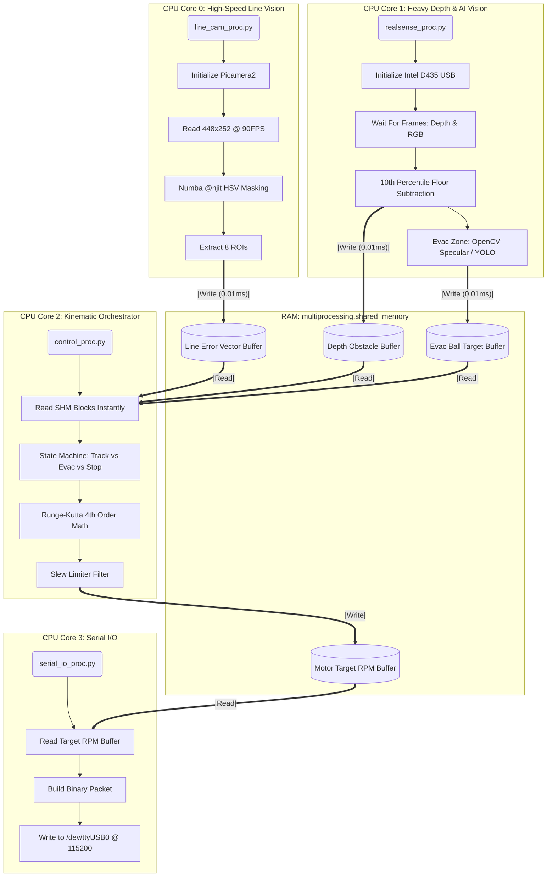
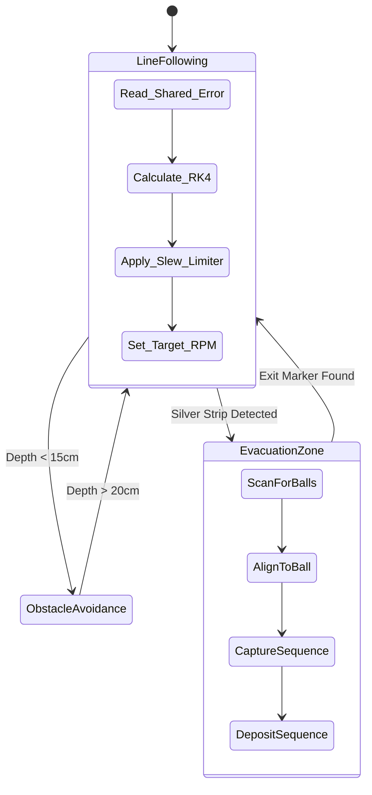

# Software Architecture: Temuv2.5 (Hybrid Overengineering)

This document provides a highly extensive and deeply technical view of the Multi-Process Software Architecture. 

By eliminating Python's Global Interpreter Lock (GIL) through native OS process forking and utilizing zero-copy RAM buffers, we guarantee that Heavy Vision Operations (like RealSense Depth mapping and YOLO11n AI segmentation) will **never** cause the primary steering kinematics (RK4 tracking loop) to drop below 60 FPS.

---

## 1. Multi-Processing OS Layout

The system spans 4 independent Linux processes. The OS kernel's Completely Fair Scheduler (CFS) automatically pins these processes across the Raspberry Pi 4B's four ARM Cortex-A72 physical cores.

---

## 2. Algorithm Pipelines

### 2.1 The Ultra-Fast Line Tracking Pipeline (`line_cam_proc.py`)
> **Source**: Raspberry Pi Camera Module (CSI). **Framerate**: 90 FPS.

Because the Pi Camera uses the hardware ISP and completely bypasses the USB controller, we dedicate it *solely* to tracking the line.
1. **Acquisition**: `Picamera2` grabs frames downsampled to exactly `448 x 252` pixels.
2. **JIT Acceleration**: Image arrays are passed to a function decorated with `Numba @njit(fastmath=True)`. Python's slow internal iteration is completely replaced by compiled C-level machine code.
3. **HSV Masking**: The array is masked to isolate the black line and the green intersection markers.
4. **ROI Slicing (4-8 Blocks)**: The image is divided horizontally into 4 to 8 slices (Regions of Interest).
5. **Centroid Mathematics**: The center of mass for the line segment in each ROI is calculated. A curve vector is generated and written into the `multiprocessing.shared_memory` buffer for the Control Process.

### 2.2 The Heavy Depth & AI Pipeline (`realsense_proc.py`)
> **Source**: Intel RealSense D435 (USB 3.0). **Framerate**: 30 FPS.

This process handles computationally heavy tasks. It runs at a lower framerate (30 FPS), but because it is in a separate OS process, it **never slows down the 90 FPS steering**.

**A. Trajectory Safety (Depth Stream)**:
1. `wait_for_frames()` blocks until a new 640x480 Depth Z16 frame arrives over USB.
2. We mathematically project where the "flat floor" should be based on camera pitch and mounting height.
3. We subtract the actual depth from the "expected floor". Any pixels remaining represent vertical physical objects.
4. We take the **10th percentile closest value** to filter out sensor noise and determine exactly how close the nearest physical obstacle is.
5. We write this safety distance float to shared memory.

**B. Evacuation Zone Ball Alignment (RGB Stream)**:
*Note: This logic only executes when the State Machine enters the Evac Zone state.*
1. **Option 1 (Zero-Weight Absolute Lightest)**: Pure OpenCV Specular / Thresholding Pipeline. Looks for the high-intensity specular highlight of the silver balls, combined with Hough Circles or shape contour circularity metrics.
2. **Option 2 (YOLO11n-seg)**: We run a lightweight YOLO11-Nano semantic segmentation model. It draws bounding boxes and masks around "Dead Victim (Black)" and "Alive Victim (Silver)".
3. We calculate the X-offset of the target ball from the center of the frame and write an "Alignment Error Vector" to shared memory.

### 2.3 The Control & Kinematics Orchestrator (`control_proc.py`)
This is the logical brain of the robot.

1. **State Machine Execution**: Instantly reads the Line Vector, Obstacle Distance, and Ball Alignment from shared memory.
2. **RK4 Numerical Integration**: Instead of simple Proportional steering, we use Runge-Kutta 4th Order math to mathematically predict the robot's smooth arc toward the line centroid over the `dt` timestep.
3. **Slew Limiter**: A recursive filter algorithm restricts the maximum mathematical rate of change (acceleration) sent to the motors. This ensures the tires never lose static friction (slip) when the RK4 loop requests a sudden sharp turn on a 90-degree intersection.
