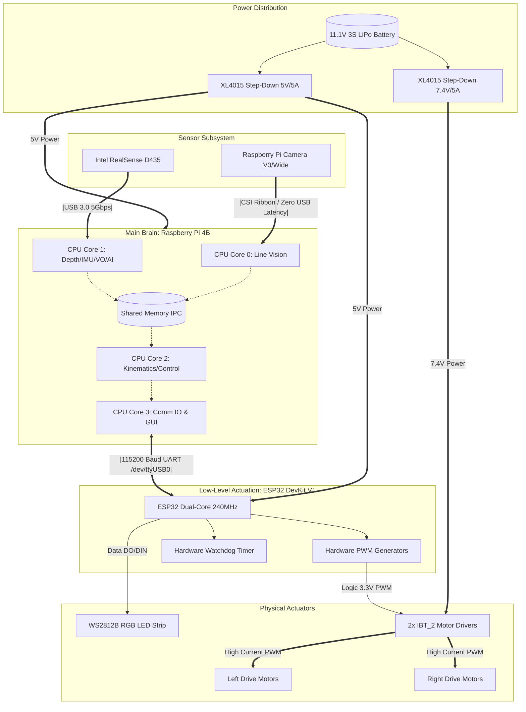
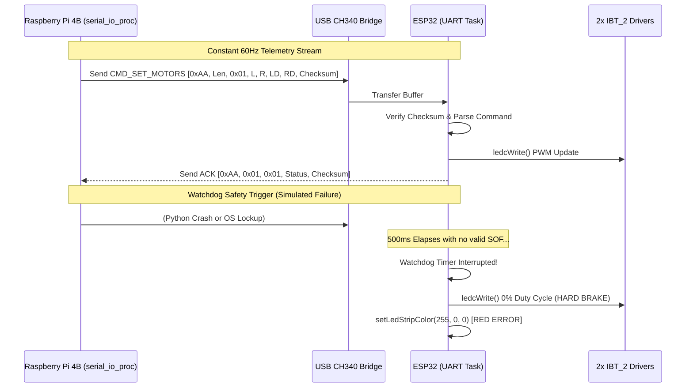

# System Architecture: Temuv2.5 (Hybrid Overengineering)

This document provides a highly detailed, extensive architectural breakdown of the Temuv2.5 hardware topology, physical sensor layout, data transmission pipelines, and power distribution systems. 

Our hybrid architecture takes the zero-latency, multi-core processing paradigms from the *Overengineering-squared-RoboCup* repository and combines them with the mathematical kinematics and true 3D spatial mapping of *TemuFollower*.

---

## 1. High-Level Hardware Topology

The robot operates using a heterogeneous computing architecture: a high-level embedded Linux system (Raspberry Pi) orchestrates complex spatial planning, while a Real-Time Operating System (RTOS) or bare-metal microcontroller (ESP32) guarantees microsecond-accurate actuation.

---

## 2. Sensor Suite Architecture

To prevent CPU saturation on the USB bus and ensure maximum framerates where it matters, we have strictly isolated the responsibilities of our two primary vision sensors.

### 2.1 Primary Vision: Pi Camera (CSI Ribbon)
> **Mission Objective**: High-Speed Trajectory Generation (Line Tracking) Only.

- **Hardware Layer**: Raspberry Pi Camera Module (CSI).
- **Physical Interface**: Ribbon cable connected directly to the Pi's internal MIPI CSI-2 port.
- **Why CSI?**: By utilizing the CSI port, we completely bypass the Raspberry Pi's USB controller (which handles network and serial). Image frames are fed directly into the Broadcom VideoCore GPU / Image Signal Processor (ISP). This enables instantaneous debayering and white balance in hardware.
- **Resolution Matrix**: `448 x 252` pixels.
  - This low resolution allows the NumPy and OpenCV contour processing arrays to complete in `< 3 milliseconds` per frame, maintaining a consistent **90 FPS**.
- **Scope**: Exclusively handles the extraction of the black line against the white floor, and green intersection markers. **It does not perform AI or evacuation zone operations.**

### 2.2 Secondary Vision & Sensors: Intel RealSense D435i
> **Mission Objective**: 3D Obstacles, Evacuation Zone Alignment, IMU Sensor Fusion, and Visual Odometry.

- **Hardware Layer**: Intel RealSense D435i Stereo Vision Camera (Built-in Bosch BMI085 IMU).
- **Physical Interface**: High-Speed USB 3.0 Type-C.
- **Resolution Matrix**: 
  - Depth Stream: `640 x 480` @ 30/60 FPS (Z16 format).
  - RGB Stream: `640 x 480` @ 30/60 FPS (BGR8 format).
- **Scope**: 
  1. **Trajectory Safety**: Continuously evaluates a geometric projection of the ground floor. Subtracts the floor depth to detect 3D vertical objects. It stops the robot (overriding the Pi Camera) if an object is within 15.0 cm (10th percentile closest algorithm).
  2. **Evacuation Zone Target Acquisition**: Uses the RGB stream to perform "Zero-Weight" OpenCV Specular Thresholding OR YOLO11-Nano Segmentation (`yolo11n-seg`) to align with silver and black victims/balls.
  3. **Sensor Fusion & Odometry**: Reads the internal Gyro and Accel to compute Pitch/Roll for Slope Detection. Simultaneously computes Visual Odometry (spatial translation X/Y/Z) to assist navigation.

---

## 3. Communication Protocol (RPi ↔ ESP32)

To ensure the Raspberry Pi's Python garbage collection and Non-Real-Time operating system scheduling do not cause motor stuttering, the ESP32 is solely responsible for generating stable PWM frequencies and acting as a hardware safety watchdog.

### 3.1 UART Packet Flow Diagram

### 3.2 Protocol Binary Definition

The protocol implements a strict deterministic binary schema to prevent buffer desynchronization during high-frequency transmission.

**Packet Structure:**
`[ SOF | Length | Command ID | Payload Bytes ... | Checksum ]`

| Byte Index | Field Name | Size | Description |
| :---: | :--- | :---: | :--- |
| `0` | **SOF (Start of Frame)** | 1 byte | Hardcoded to `0xAA`. Used to align the parser state machine. |
| `1` | **Length** | 1 byte | The total number of bytes in the `Payload` segment. |
| `2` | **Command ID** | 1 byte | The opcode representing the instruction. |
| `3...N` | **Payload** | `Len` bytes | Variable length parameters (e.g., motor speeds, LED colors). |
| `N+1` | **Checksum** | 1 byte | A bitwise XOR (`^`) of the Length, Command ID, and all Payload bytes. |

### 3.3 Command Operations Dictionary

| Action Name | Command ID (Hex) | Payload Structure | Expected ESP32 Behavior |
| :--- | :---: | :--- | :--- |
| `CMD_SET_MOTORS` | `0x01` | `[LeftPWM, RightPWM, LeftReverse(0/1), RightReverse(0/1)]` (4 bytes) | Immediately updates the hardware PWM timers for the IBT_2 drivers. Resets the 500ms safety watchdog. |
| `CMD_STOP_ALL` | `0x02` | `[]` (0 bytes) | Instantly grounds all PWM channels, initiating a hard motor brake. |
| `CMD_SET_LED` | `0x06` | `[Red, Green, Blue, Brightness]` (4 bytes) | Updates the WS2812B data line to render a new color. Used for visual state debugging (e.g., Green = Following, White = Idle, Blue = Evac Zone). |
| `CMD_PING` | `0xFF` | `[0x55]` (1 byte) | Echo request. Resets the watchdog timer. The ESP32 responds with a corresponding Pong packet to verify full-duplex communication health. |
