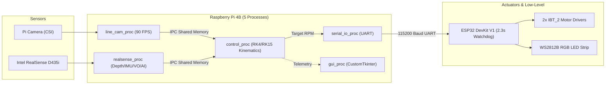

# System Overview: Temuv2.5 (Hybrid Overengineering)

The DPSI LFR V3 platform operates on the **Temuv2.5 (Hybrid Overengineering)** architecture. It bridges high-speed 90 FPS line tracking with true 3D spatial mapping, IMU-assisted slope traversal, and multi-process telemetry.

## Core Objectives
1. **Ultra-Fast Line Tracking**: Maintain a 90 FPS line-following control loop on the Raspberry Pi 4B using hardware CSI acquisition and Numba JIT acceleration.
2. **True 3D Spatial Safety**: Use 10th-percentile ground floor subtraction on the RealSense depth stream to brake for physical obstacles within 15 cm.
3. **IMU Sensor Fusion & Slope Traversal**: Read the RealSense D435i IMU Gyro/Accel to compute Pitch/Roll, automatically shifting into a High-Torque, Medium-Speed mode on ramps.
4. **Evacuation Zone Target Acquisition**: Perform "Zero-Weight" OpenCV Specular Thresholding OR YOLO11-Nano semantic segmentation to locate silver and black victims.
5. **Decoupled Telemetry**: Monitor real-time gauges and visual streams via a CustomTkinter dark-mode GUI running in an isolated 5th process.

## Hardware Stack Summary
- **High-Level Compute**: Raspberry Pi 4B (ARM Cortex-A72 Quad-Core).
- **Low-Level Compute**: ESP32 DevKit V1 (Dual-Core 240MHz).
- **Drive Electronics**: 2x IBT_2 (BTS7960) High-Current Motor Drivers connected to 7.4V LiPo power.
- **Vision & Sensing**: 
  - Raspberry Pi Camera V3/Wide (MIPI CSI-2).
  - Intel RealSense D435i (USB 3.0, Stereo Depth, BGR RGB, Bosch BMI085 IMU).
- **Visual Status**: 3-pin WS2812B RGB LED Strip controlled via UART opcode `0x06`.

## Software Stack Summary
- **OS**: Embedded Linux.
- **IPC Architecture**: 5-Process `multiprocessing.shared_memory` using zero-copy flat C-style float arrays (`[LineError, LineAngle, DistanceToWall, BallX, BallY, Pitch, Roll, Yaw]`).
- **Kinematics Engine**: Runge-Kutta 4th (RK4) & 15th (RK15) Order numerical integration with Slew Limiter filter.
- **Watchdog Protection**: 2300ms hardware communication timeout on the ESP32 to prevent runaway motors.
